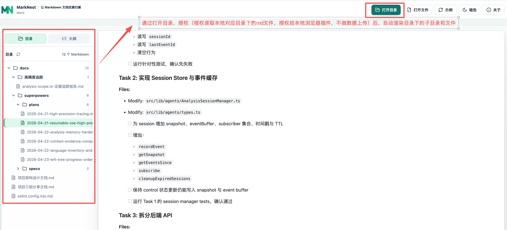
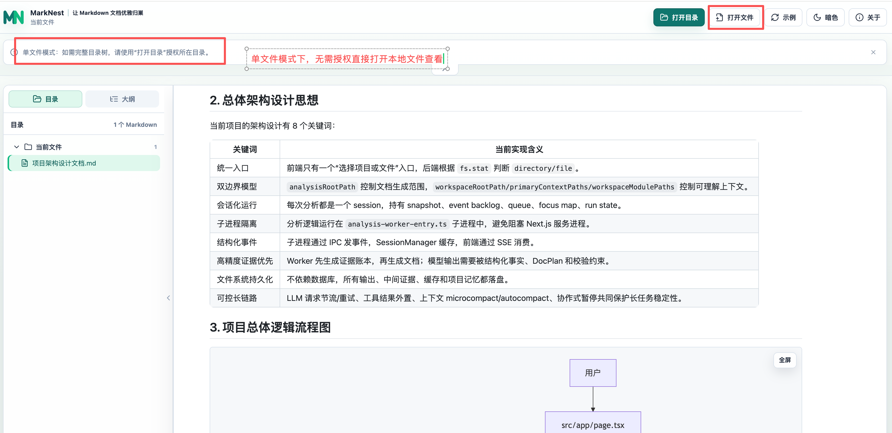
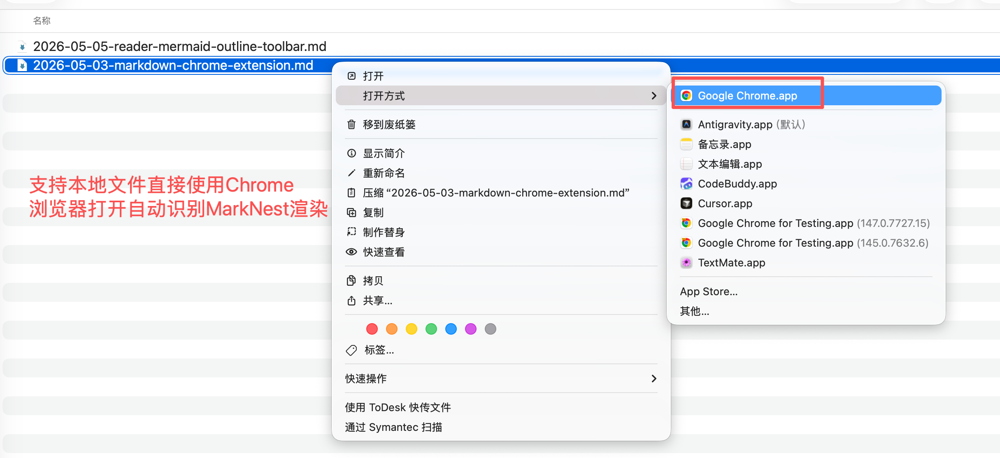
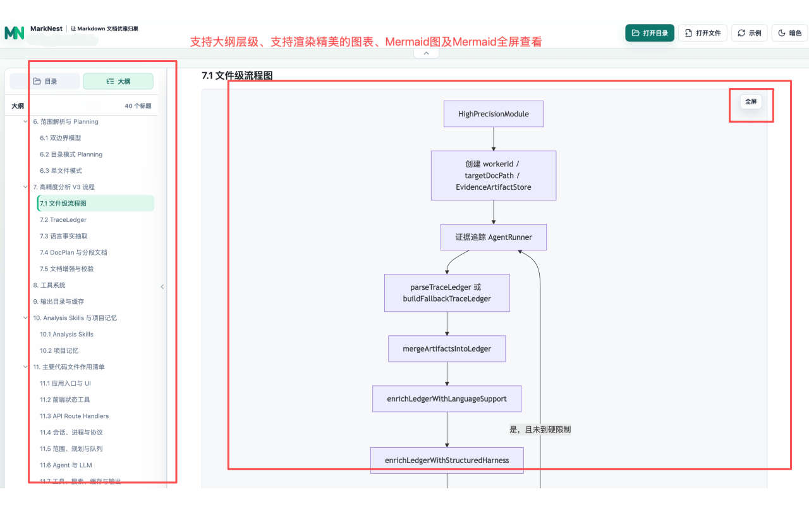
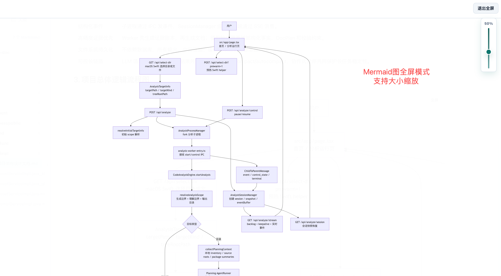

# MarkNest

让 Markdown 文档优雅归巢，在 Chrome 中沉浸阅读本地文档。

MarkNest 是一个本地优先的 Markdown 文档阅读工作区。它以 Chrome Manifest V3 扩展的形式运行，打开 `file://` Markdown 文件或本地目录页后，MarkNest 会直接在原始本地地址内渲染文档、展示目录树和文档大纲，并支持 Mermaid 图表、数学公式、GFM 表格和暗色模式。

## 产品预览











## 项目定位

MarkNest 不是 Markdown 编辑器，也不是云端同步工具。它更像一个本地 Markdown 文档浏览器：

- 适合阅读 README、项目文档、技术方案、知识库和架构说明。
- 文件内容在浏览器本地处理，不上传到服务器。
- 通过用户主动选择文件或目录授权，不静默扫描磁盘。
- 面向长文档阅读，提供目录树、大纲、返回顶部、Mermaid 全屏缩放等阅读能力。

## 功能特性

- 在 `file://.../*.md` 页面内直接渲染本地 Markdown，地址栏保留原始文件路径。
- 自动识别当前文件同级目录和子目录中的 Markdown 文件树。
- 支持目录/大纲切换、侧栏折叠、右上角沉浸式控制菜单。
- 支持 GFM 表格、任务列表、标题锚点、代码高亮、KaTeX 数学公式。
- 支持 Mermaid 图表渲染、横向滚动、全屏查看和缩放。
- 支持本地图片路径重写，方便阅读包含相对路径图片的文档。
- 支持亮色、暗色和跟随系统主题。
- 使用浏览器本地能力读取文件，不上传文档内容。

## 技术栈

- Next.js App Router，静态导出
- React 19
- TypeScript
- Chrome Manifest V3
- unified / remark / rehype
- Mermaid
- KaTeX
- Shiki
- Vitest
- Testing Library
- Playwright

## 本地开发

### 环境要求

- Node.js 20 或更高版本
- npm
- Chrome 或 Chromium

### 拉取代码

```bash
git clone https://github.com/AIAgentAndy/MarkNest.git
cd MarkNest
```

### 安装依赖

```bash
npm install
```

如果需要完全按 `package-lock.json` 安装，可以使用：

```bash
npm ci
```

### 启动本地开发服务

```bash
npm run dev
```

默认访问：

```text
http://127.0.0.1:3000
```

也可以直接进入示例工作区：

```text
http://127.0.0.1:3000/?sample=1
```

## 本地验证

常用检查命令：

```bash
npm run lint
npm run typecheck
npm test
npm run build
```

端到端测试：

```bash
npm run test:e2e
```

Playwright 首次运行前，如果本机缺少浏览器依赖，可按 Playwright 提示安装。

## 构建 Chrome 扩展

先构建 Next.js 静态产物：

```bash
npm run build
```

再生成 Chrome 扩展目录：

```bash
npm run build:extension
```

生成结果位于：

```text
dist/extension
```

## 在 Chrome 中加载本地扩展

1. 打开 Chrome。
2. 访问 `chrome://extensions`。
3. 打开右上角“开发者模式”。
4. 点击“加载已解压的扩展程序”。
5. 选择本项目的 `dist/extension` 目录。
6. 进入扩展详情页，开启“允许访问文件网址”。
7. 在 Chrome 中直接打开本地 Markdown，例如 `file:///Users/andy/Documents/demo.md`；也可以打开在线 Markdown 原始地址，例如 `https://example.com/docs/guide.md`。

扩展工具栏图标打开 MarkNest 使用引导页，不再提供文件选择器。本地 Markdown 通过 Chrome 直接打开后会保留 `file:///...` 地址；开启“允许访问文件网址”后，扩展会在浏览器本地识别同级和子目录中的 Markdown。在线 Markdown 只渲染当前文件，不扫描远程目录。阅读页右上角默认只有一个菜单图标，点击后可切换原始内容、全屏、打印、亮色/暗色、反馈和关于。


## 目录结构

```text
src/
├── app/                       Next.js App Router 入口
├── features/
│   ├── file-tree/             Markdown 文件树扫描与 UI
│   ├── markdown-renderer/     Markdown 渲染管线与阅读组件
│   └── workspace/             file:// 直渲染宿主、工作区授权和示例数据
└── shared/
    ├── browser/               浏览器 API 类型
    ├── db/                    IndexedDB 持久化
    └── path/                  路径与扩展名工具

extension/                     Chrome MV3 manifest、后台脚本、直渲染工具和图标
scripts/                       构建扩展与生成图标脚本
tests/                         单元、组件和 e2e 测试
```

## 许可证

本项目使用 MIT License，详见 [LICENSE](./LICENSE)。
